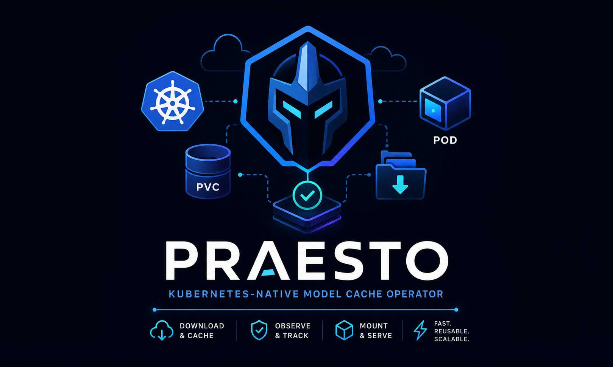

<h1 align="center">Praesto</h1>

<h3 align="center">
  <a name="readme-top"></a>
  
</h3>

<div align="center">

<p align="center">
  Kubernetes-native model cache operator, node-agent, and CSI driver for mounting AI model artifacts into workloads.
</p>

<div align="center">
  <a href="https://github.com/federicolepera/praesto/blob/main/LICENSE">
    
  </a>
  <a href="https://github.com/federicolepera/praesto/releases">
    
  </a>
  <a href="https://goreportcard.com/report/github.com/federicolepera/praesto">
    
  </a>
</div>

<div align="center">
  <a href="https://ghcr.io/federicolepera/praesto">
    
  </a>
  <a href="https://kubernetes.io/">
    
  </a>
  <a href="https://github.com/federicolepera/praesto/pkgs/container/praesto%2Fcharts%2Fpraesto">
    
  </a>
</div>
</div>

## What is Praesto?

Praesto helps Kubernetes workloads use AI and LLM model artifacts without downloading the same files again and again.

You declare which model you need with a `ModelCache`. Praesto prepares that cache on the selected Kubernetes nodes, then workloads receive the model as a normal mounted folder. Application containers do not need custom download logic.

The main mode is **local CSI mode**: a Praesto node-agent downloads public Hugging Face model artifacts into node-local storage, marks the cache as complete, and the CSI driver mounts it into Pods as a read-only volume. From the application point of view, the model is simply available at a path like `/models` or `/model`.

Local caches can also be evicted per node after a configured unused TTL. If a new Pod later lands on a node where its cache was evicted, the node-agent rehydrates it on demand and the CSI mount succeeds after the cache is ready again.

Praesto also supports a shared PVC mode. In that mode, Praesto uses a PVC + downloader Job flow for clusters that prefer RWX storage.

## Installation

Install Praesto first, then create `ModelCache` resources and annotated workloads.

### Prerequisites

You need:

- a Kubernetes cluster
- `kubectl`
- `helm`
- cert-manager installed in the cluster when `webhooks.certManager.enabled=true` (default)
- for local CSI mode, node-local storage prepared as described below
- for shared PVC mode, a StorageClass that supports `ReadWriteMany`

### Prepare node local cache storage

For local CSI mode, prepare the cache base path on every node where Praesto may cache models. This is typically a fast local SSD mount:

```text
/var/praesto
```

Example on each cache-capable node:

```bash
sudo mkdir -p /var/praesto
sudo chmod 0775 /var/praesto
```

If you use a different path, set it in Helm:

```yaml
localCache:
  basePath: /mnt/fast-ssd/praesto
```

Praesto expects the base path to already exist. The `praesto-node-agent` DaemonSet creates and owns per-cache directories below it:

```text
<basePath>/<namespace>/<modelcache>
```

For example:

```text
/var/praesto/praesto-ovms/ovms-distilbert-squad
```

The namespace directory may remain after cleanup, but Praesto removes the per-model subdirectory when the corresponding `ModelCacheNode` is deleted.

Deleting a local-mode `ModelCache` deletes its `ModelCacheNode` resources. The node-agent finalizer then removes the node-local model directory before the `ModelCacheNode` disappears.

To run the node-agent only on selected nodes, label those nodes and configure `nodeAgent.nodeSelector`:

```bash
kubectl label node <node-name> praesto.io/cache-node=true
```

```yaml
nodeAgent:
  nodeSelector:
    praesto.io/cache-node: "true"
```

Make sure the node-agent runs on every node that a local-mode `ModelCache.spec.nodeSelector` may select.

### Install with Helm

Install Praesto with the local chart:

```bash
helm install praesto ./charts/praesto \
  --namespace praesto-system \
  --create-namespace
```

Pin release images explicitly:

```bash
helm install praesto ./charts/praesto \
  --namespace praesto-system \
  --create-namespace \
  --set image.tag=0.6.0 \
  --set downloader.image.tag=0.6.0 \
  --set csi.image.tag=0.6.0 \
  --set nodeAgent.image.tag=0.6.0
```

The chart can also be published and installed as an OCI Helm package from GHCR:

```bash
helm install praesto oci://ghcr.io/federicolepera/praesto/charts/praesto \
  --version 0.6.0 \
  --namespace praesto-system \
  --create-namespace
```

Wait for Praesto components:

```bash
kubectl get pods -n praesto-system
```

With local CSI mode enabled, you should see the controller manager, CSI node DaemonSet, and node-agent DaemonSet running in `praesto-system`.

For chart options, see the commented [Helm values example](docs/helm/values.yaml) and the [Chart documentation](charts/praesto/README.md).

## Storage modes

Praesto supports two storage modes. The mode is selected by `spec.storage.storageClassName`:

- **Local CSI mode**: the primary mode. Leave `storageClassName` empty. Praesto creates one `ModelCacheNode` per selected node; the node-agent downloads the model into node-local storage; the CSI driver mounts the completed cache into Pods. No PV, PVC, or downloader Job is created for this mode.
- **Shared PVC mode**: set `storageClassName`. Praesto creates a shared RWX PVC and a downloader Job, then mounts that PVC into Pods. This mode does not use `ModelCacheNode`.

Minimal local CSI `ModelCache`:

```yaml
apiVersion: praesto.praesto.io/v1alpha1
kind: ModelCache
metadata:
  name: tinyllama
  namespace: default
spec:
  source:
    huggingface:
      repo: TinyLlama/TinyLlama-1.1B-Chat-v1.0
  storage:
    size: 5Gi
  nodeSelector:
    praesto.io/cache-node: "true"
```

Minimal shared PVC `ModelCache`:

```yaml
apiVersion: praesto.praesto.io/v1alpha1
kind: ModelCache
metadata:
  name: tinyllama-rwx
  namespace: default
spec:
  source:
    huggingface:
      repo: TinyLlama/TinyLlama-1.1B-Chat-v1.0
  storage:
    size: 5Gi
    storageClassName: rwx-storage-class
```

Local CSI mode currently supports public Hugging Face downloads from the node-agent. Hugging Face token/private model support remains available in the PVC downloader Job flow and will be added to local mode later.

For local CSI mode, the node-agent writes cache markers into each model directory:

```text
.praesto-owner
.praesto-manifest.json
.praesto-complete
```

The CSI driver mounts a cache only after `.praesto-complete` exists, so workloads do not see partially downloaded models.

See the [storage modes documentation](docs/STORAGE_MODES.md) for examples and details.

## Demo

Praesto includes an OpenVINO Model Server demo: it downloads two OpenVINO-ready models, mounts both into one Pod through the CSI driver, and serves them from a single model server.

See the [demo documentation](docs/DEMO.md).

## Quickstart

For a short end-to-end walkthrough, see the [quickstart guide](docs/QUICKSTART.md).

## Admission Webhooks

Praesto uses admission webhooks for model validation and Pod volume injection.

### Mutating Pod webhook

The mutating webhook injects a ready model cache into annotated Pods.

Before creating annotated Pods, enable injection in the workload namespace:

```bash
kubectl label namespace <namespace> praesto.io/model-cache-injection=enabled
```

Namespaces without this label are ignored by the mutating webhook. This keeps unrelated workloads from depending on Praesto webhook availability.

Recommended annotation:

```yaml
praesto.io/model-mounts: |
  [
    {"modelCache":"ovms-distilbert-squad","mountPath":"/models/distilbert/1"},
    {"modelCache":"ovms-vit-food101","mountPath":"/models/vit/1"}
  ]
```

Optional annotations:

```yaml
praesto.io/target-container: ovms
```

If the target container is omitted, Praesto mounts the cache into the first container in the Pod spec.

The older single-model annotations are still supported for compatibility, but `praesto.io/model-mounts` is the preferred form:

```yaml
praesto.io/model-mounts: |
  [
    {"modelCache":"tinyllama-test","mountPath":"/models"}
  ]
```

The webhook:

- reads the requested `ModelCache` from the Pod namespace
- requires the `ModelCache` to be `Ready`
- injects a read-only CSI volume for local CSI mode (`storageClassName` empty)
- injects a read-only PVC volume for shared PVC mode (`storageClassName` set)

The webhook uses `failurePolicy: Fail` inside opt-in namespaces. If Praesto is unavailable, annotated Pods in enabled namespaces are rejected instead of running without their model cache.

### Validating ModelCache webhook

The validating webhook checks common `ModelCache` input errors:

- `spec.storage.size` is required and must be greater than zero
- `spec.source.huggingface.repo` is required
- HuggingFace token `secretRef.name` and `secretRef.key` must be configured together
- `spec` is immutable after creation
- in shared PVC mode, `spec.storage.storageClassName` must reference an existing StorageClass

## License

Apache License 2.0. See [LICENSE](LICENSE) for details.
